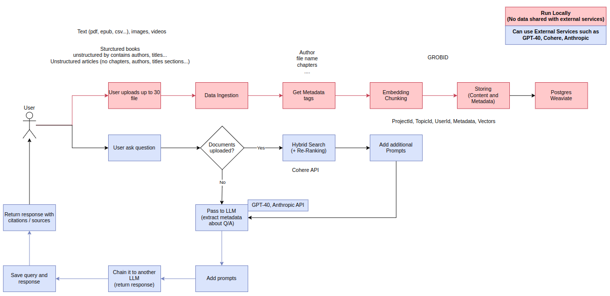

# RAG - Weaviate Hybrid Search



## Overview

This project implements a Retrieval-Augmented Generation (RAG) system with Weaviate as the vector database, featuring hybrid search capabilities. The system processes various document types (PDFs, EPUBs, CSVs, images, videos) and provides intelligent question-answering functionality while maintaining conversation history.

## Key Features

- **Multi-format Support**: Handles structured books, unstructured articles, images, and videos
- **Hybrid Search**: Combines vector search with keyword-based retrieval
- **Re-ranking**: Uses Cohere's reranking API to improve result quality
- **Conversation History**: Maintains context-aware chat history in PostgreSQL
- **Local Processing**: Option to run entirely locally without external services
- **Metadata Extraction**: Processes document metadata for enhanced search
- **Video Transcription**: Whisper model for audio/video content processing

## Technology Stack

- **Vector Database**: Weaviate (local deployment)
- **Embeddings**: HuggingFace multilingual-e5-large
- **LLM**: Google Gemini (with options for GPT-4, Anthropic, etc.)
- **Reranking**: Cohere API
- **Database**: PostgreSQL
- **Document Processing**: Unstructured.io library
- **Audio Processing**: Whisper (for video/audio transcription)

## Installation

### Prerequisites

- Docker and Docker Compose
- Python 3.10+
- Required environment variables (see `.env.example`)

### Setup

1. Clone the repository:
   ```bash
   git clone https://github.com/Osama-Abo-Bakr/rag-weaviate-hybrid-search
   cd rag-weaviate-hybrid-search
   ```

2. Create and configure your `.env` file:
   ```bash
   cp .env.example .env
   # Fill in your API keys and database credentials
   ```

3. Start the services:
   ```bash
   docker-compose up -d
   ```

4. Install Python dependencies:
   ```bash
   pip install -r requirements.txt
   ```

5. Initialize the database:
   ```python
   python -c "from helper.db_connection import create_chat_history_table; create_chat_history_table()"
   ```

## Usage

### Loading Documents

```python
from Loading_data import load_files, load_data
from vector_store import adding_vector_db

# Process files
file_paths = ["doc1.pdf", "doc2.docx"]
text_data = load_files(file_paths)
chunks = load_data(text_data)

# Add to vector store
vector_store_id = "my_documents"
adding_vector_db(vector_store_id, chunks)
```

### Querying the System

```python
from full_chain import get_response

response = get_response(
    question="What is the main topic of these documents?",
    vector_store_id="my_documents",
    user_id="user123",
    project_id="project456"
)

print(response["answer"])
```

### API Endpoints

The system can be exposed as a REST API using FastAPI or similar frameworks. Example endpoints would include:

- `/upload` - For document ingestion
- `/query` - For question answering
- `/history` - For retrieving conversation history

## Configuration

Key configuration options in `.env`:

| Variable | Description |
|----------|-------------|
| `GOOGLE_API_KEY` | API key for Google Gemini |
| `COHERE_API_KEY` | API key for Cohere reranking |
| `DB_*` | PostgreSQL connection parameters |

## Project Structure

```
📂
├── helper/
│   ├── db_connection.py       # Database operations
│   └── vector_store.py        # Weaviate interactions
│   └── Loading_data.py        # Document processing
│   └── full_chain.py          # Main RAG pipeline
├── models/
│   ├── intfloat_multilingual_e5_large
│   └── thenlper_gte_large
├── main.py
├── docker-compose.yml         # Weaviate and Science-Parse containers
└── .env.example               # Environment template
```

## Performance Considerations

- **Chunk Size**: Currently set to 1000 characters with 200 overlap
- **Search Parameters**: MMR search with k=5, fetch_k=10
- **Connection Pooling**: PostgreSQL pool size=10, max_overflow=20

## Limitations

- Currently requires manual setup of Whisper models
- Video processing can be resource-intensive
- Local Weaviate instance may need tuning for production loads

## Future Enhancements

- Implement authentication for multi-user support
- Add support for more file formats
- Implement batch processing for large document sets
- Add monitoring and performance metrics

## Contact

For questions or support, please contact:
📞 +20-1274011748
📧 osamaoaboabkr12@gmail.com