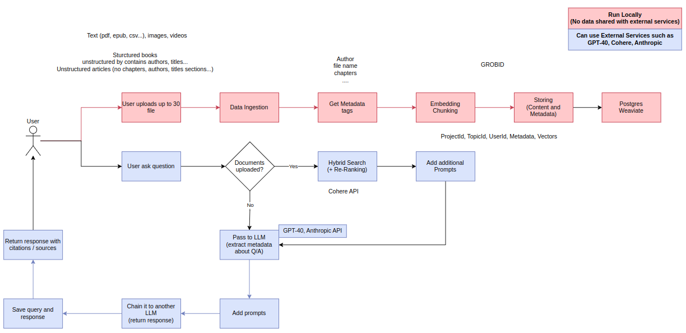

## **Project Overview**  
The goal of the project is to build a **conversational AI platform** with a **RAG (Retrieval-Augmented Generation) backend system** optimized for searching content from **images, PDFs, EPUB, Word, Excel, and other text-based documents containing images and tables**.  

The system provides **three main functionalities**:  
1. **Conversational AI**: Users can engage in a natural conversation with **GPT-Mini** (if no documents are uploaded).  
2. **Document Ingestion & Processing**: Users can **upload** and process various document formats (PDFs, images, text files, etc.).  
3. **Document-Based Question Answering**: Users can **ask questions** about the content of uploaded documents.  

---

## **Core System Components**  

### **1. Document Ingestion & Extraction**  
- Use **Unstructured** library to process diverse document formats (**EPUB, Word, PDF, Excel**).  
- Extract **metadata** (author, title, subject, creation date, page count) using **PyPDF2, EbookLib**.  
- Parse **text, tables, and images** while maintaining their reference to the original document.  

### **2. Chunking Strategy**  
- Implement **paragraph-based chunking** (~500 tokens per chunk).  
- **Tables** are stored as separate chunks.  
- **Images** are stored separately with **contextual metadata**.  

### **3. Embedding Generation**  
- Process **English text/table chunks** using **GTE-Large (1024-dimensional embeddings)**.  
- Process **French text/table chunks** using **intfloat/multilingual-e5-large**.  
- Generate **image embeddings** using **OpenAI's text-embedding-3-large**.  

### **4. Storage & Indexing**  
- Store **embeddings** and **metadata** in **Weaviate**.
- Maintain **additional metadata** in **PostgreSQL**.  
- Ensure **consistent IDs** across systems for efficient cross-referencing.  

### **5. Retrieval & Search Mechanism**  
- Implement **semantic/hybrid search** using **Weaviate** for similarity-based retrieval.  
- Apply **re-ranking** of top results using the **Cohere API** for better relevance.  
- Return **optimized results** to the LLM for response generation.

### **6. External LLM Integration**  
- Design a dedicated **endpoint** for handling **queries outside the RAG context**.  
- Implement API integration with:  
  - **Anthropic (Claude)**  
  - **OpenAI (GPT models)**  
- Develop a **query routing mechanism** to determine whether to use **RAG or external LLMs**.  
- Implement a **fallback system** where external LLMs are used if **RAG results are insufficient**.  
- Support **session management** to maintain conversation context across query types.  

---

## **Implementation Details**  

### **7. Frameworks & Tools**  
- **LlamaIndex**: For data pipeline (from ingestion to retrieval).  
- **LangChain**: For LLM interactions (both RAG-based and direct model calls).  
- Support **streaming responses** from both RAG and external LLMs.  
- Implement **rate limiting & cost control** for external API calls.  
- Ensure **authentication & authorization** for secure API access.  

---

## **8. API Endpoints**  

| Endpoint   | Functionality |
|------------|--------------|
| **/ingest**  | Upload and process documents |
| **/query**  | Search and retrieve content using RAG |
| **/chat**  | Handle conversations beyond document context |
| **/hybrid** (optional) | Automatically decide between RAG & external LLMs |

---

## **9. User Experience & Features**  
- Users can **upload up to 30 documents** and query their content.  
- Questions can be asked about:  
  - **Specific files, books, chapters, pages, images, or tables**.  
- If a query extends **beyond the document context**, the system **seamlessly transitions** to external LLMs (Claude/GPT).  
- The system is designed with **modularity & flexibility**, allowing future enhancements based on evolving requirements.  

---

## **Some Idea**
1. Create Json Schema for storing User-Data info like this : json: 
